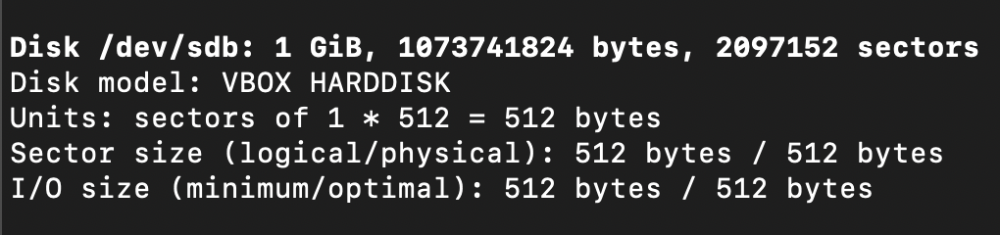
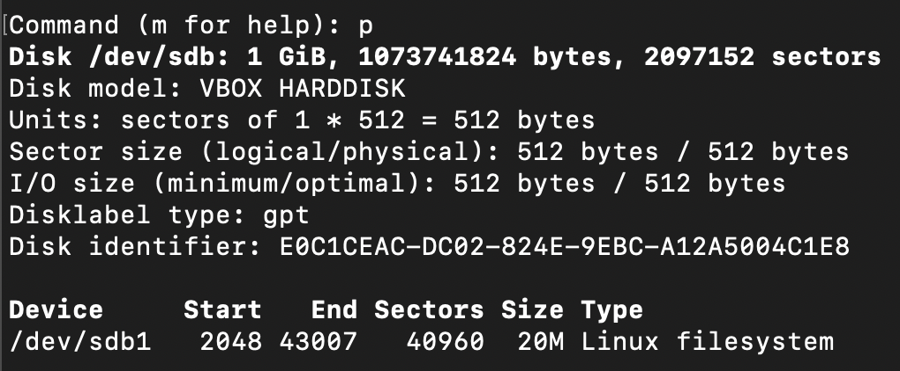
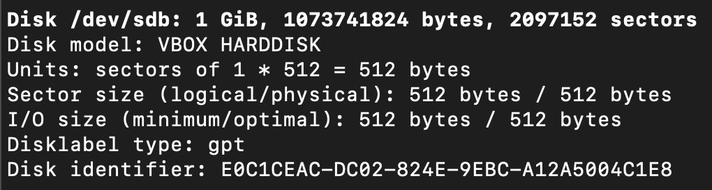
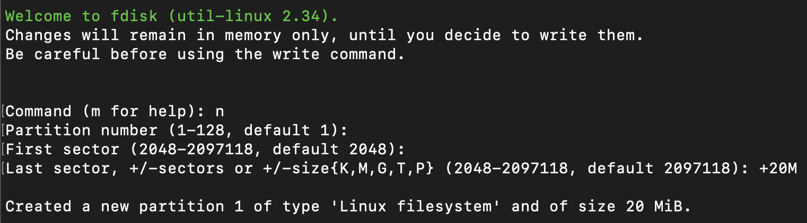

# `fdisk` (8) Command

*Privilege required*

Manipulate disk partition table

## Examples

### List all partitions of all devices

```sh
sudo fdisk -l
```



### List all partitions of a specific device

1. Select device to manage partitions

```sh
sudo fdisk %device-path%
```

2. Print the partition table

```sh
p
```

#### Output



### Create a GPT partition table

1. Select device to manage partitions

```sh
sudo fdisk %device-path%
```

2. Create empty GPT partition table

```sh
g
```

3. Apply change

```sh
w
```

#### Output



### Create a Linux file system partition

1. Select device to manipulate

```sh
sudo fdisk %device-path%
```

2. Create new partition

```sh
n
```

We need to fill:
- Partition number
- First sector
- Partition size
  - +Number of sectors
  - +Number K,M,G,T,P bytes

3. Write change

```sh
w
```

#### Output

