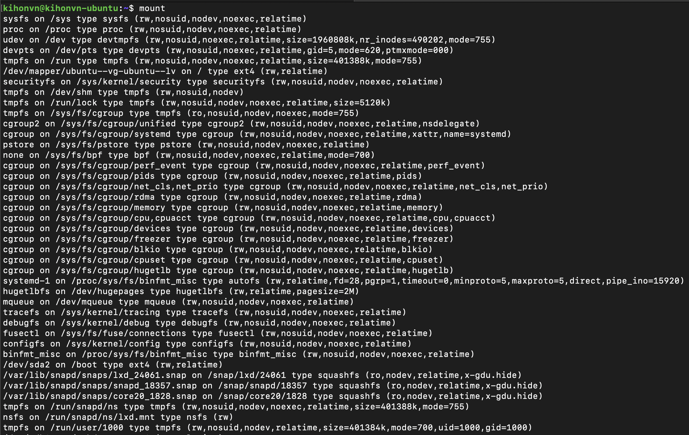

# `mount` (8) Command

*Privilege require*

Mount (view mounted) file systems

## Examples

### View mounted file systems

```sh
mount
```

#### Output



### Mount a partition

```sh
sudo mount %device-partition% %directory%
```

After successfully mounting, we can use the `mount` command without parameters to check.

#### Output

```sh
/dev/sdb1 on /myhd type ext4 (rw,relatime)
```