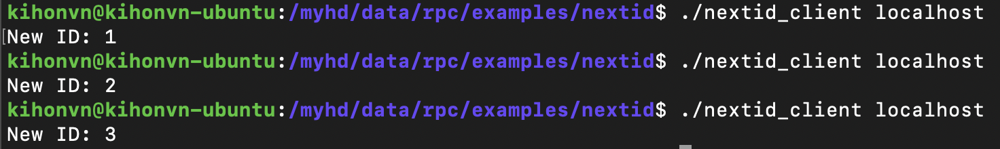

# nextid RPC Example

## Compose `nextid.idl`

```idl
program NEXT_ID {
  version VER_1 {
    int nextid() = 0;
  } = 1;
} = 2;
```

## Generate C code from `nextid.idl` using rpcgen

```sh
rpcgen -a nextid.idl
```


## Update `nextid_client.c` and `nextid_server.c`

*nextid_client.c*

```c
#include <stdio.h>
#include "nextid.h"

void next_id_1(char *host)
{
	CLIENT *clnt;
	int  *result_1;
	char *nextid_1_arg;

#ifndef	DEBUG
	clnt = clnt_create (host, NEXT_ID, VER_1, "udp");
	if (clnt == NULL) {
		clnt_pcreateerror (host);
		exit (1);
	}
#endif	/* DEBUG */

	result_1 = nextid_1((void*)&nextid_1_arg, clnt);
	if (result_1 == (int *) NULL) {
		clnt_perror (clnt, "call failed");
	} else {
		printf("New ID: %d\n", *result_1);
	}
#ifndef	DEBUG
	clnt_destroy (clnt);
#endif	 /* DEBUG */
}


int main (int argc, char *argv[]) {
	char *host;

	if (argc < 2) {
		printf ("usage: %s server_host\n", argv[0]);
		exit (1);
	}
	
	host = argv[1];
	next_id_1 (host);
	exit (0);
}
```

*nextid_server.c*

```c
#include "nextid.h"

_Atomic int id = 0;
int* nextid_1_svc(void *argp, struct svc_req *rqstp) {
  int newid = ++id;
	int* result = &newid;
	return result;
}
```

## Make client and server executable files

```sh
make -f Makefile.nextid
```

New `.o` files, and two executable files `nextid_client` and `nextid_server` are generated.


## Run `nextid_server` to start listening requests

*This requires security privilege*

```sh
sudo ./nextid_server
```

To stop the process, press `Ctrl+C`.

## Run `nextid_client` to request a next id

```sh
./nextid_client localhost
```

